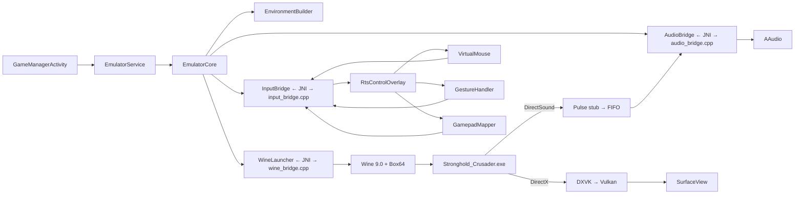

# StrongholdDroid

> محاكي **Stronghold Crusader** لأجهزة أندرويد بمعمارية ARM64 — مبني فوق Wine + Box64 + DXVK/gl4es.

[](.github/workflows/build.yml)
[](LICENSE)
[](app/build.gradle.kts)
[](app/build.gradle.kts)

---

## الهدف من المشروع

تشغيل لعبة Stronghold Crusader (إصدارات 1.1 / HD / Extreme) على هواتف أندرويد
بأداء سلس (30 إطاراً في الثانية كحد أدنى على معالجات Snapdragon 665 وأحدث)
ودون أي تقطيع في الجلسات الطويلة (2+ ساعة).

المشروع لا يبدأ من الصفر — يعتمد على:

| المكوّن | المصدر | الدور |
|---------|--------|------|
| [Wine](https://www.winehq.org) 9.0+ | GPL-2.0 | طبقة توافق Windows API |
| [Box64](https://github.com/ptitSeb/box64) | MIT | مترجمة x86_64 → ARM64 (Dynarec NEON) |
| [DXVK](https://github.com/doitsujin/dxvk) 2.x | zlib | تحويل DirectX 9/10/11 إلى Vulkan |
| [gl4es](https://github.com/ptitSeb/gl4es) | MIT | مسار احتياطي: OpenGL 4.x → GLES 3.x |
| [PulseAudio](https://www.freedesktop.org/wiki/Software/PulseAudio/) (stub) | LGPL | جسر الصوت DirectSound → AAudio |

## الميزات الرئيسية

- **3 ممرات رسومية** مع كشف تلقائي لقدرة الجهاز:
  - DXVK (Vulkan) — الأمثل لـ SC HD/Extreme
  - wined3d + Zink — الأمثل لـ SC 1.1 (DirectDraw)
  - wined3d + gl4es — للأجهزة الضعيفة
- **نظام تحكم لمسي ذكي** مخصص للألعاب الاستراتيجية:
  - ماوس افتراضي بنقطة اتصال واحدة + smoothing
  - multi-touch متزامن للسحب والإيماءات
  - إيماءات الخريطة (pinch / pan / twist)
  - دعم gamepad مع mapping مخصص
- **حاكم حراري** لجلسات 2+ ساعة مع خفض دقة ديناميكي
- **Save States** فوري عبر CRIU-style snapshot
- **بنية معيارية** فوق Winlator — سهلة التخصيص لألعاب أخرى

## البنية العامة



الشرح التفصيلي في [ARCHITECTURE.md](docs/ARCHITECTURE.md).

## التشغيل السريع

```bash
# 1. استنساخ المستودع
git clone https://github.com/your-org/StrongholdDroid.git
cd StrongholdDroid

# 2. إعداد سلسلة البناء (NDK + Mingw + Meson + Ninja)
./scripts/setup_toolchain.sh

# 3. بناء المكتبات الأصلية (Wine + Box64 + DXVK + gl4es + Pulse)
./scripts/build_all.sh     # ~35 دقيقة على 16-core

# 4. تجميع APK
./scripts/build_apk.sh debug

# 5. التثبيت على الجهاز
adb install -r app/build/outputs/apk/debug/app-debug.apk
```

التفاصيل الكاملة في [BUILD_GUIDE.md](docs/BUILD_GUIDE.md).

## الاستخدام

1. افتح التطبيق → تبويب **المكتبة**
2. اختر الإصدار: **SC 1.1** أو **SC HD** أو **SC Extreme**
3. اضغط **تشغيل** → ستظهر شاشة اللعبة مع طبقة التحكم اللمسي
4. لتثبيت ملفات اللعبة: انظر [USER_MANUAL.md](docs/USER_MANUAL.md)

## التوثيق

| المستند | الوصف |
|---------|------|
| [ARCHITECTURE.md](docs/ARCHITECTURE.md) | البنية المعمارية الشاملة + قرارات التصميم |
| [BUILD_GUIDE.md](docs/BUILD_GUIDE.md) | دليل بناء المشروع من المصدر |
| [USER_MANUAL.md](docs/USER_MANUAL.md) | دليل المستخدم النهائي |
| [TROUBLESHOOTING.md](docs/TROUBLESHOOTING.md) | دليل تشخيص المشاكل |
| [PERFORMANCE.md](docs/PERFORMANCE.md) | منهجية قياس الأداء + أهداف |

## متطلبات الأجهزة

| الفئة | مثال المعالج | هدف FPS | الدقة المستهدفة |
|-------|--------------|---------|-----------------|
| Low-end  | Snapdragon 665 / Mali-G52 | 30 | 960×540 |
| Mid-range | Snapdragon 730G / Mali-G76 | 45 | 1280×720 |
| High-end  | Snapdragon 855+ / Adreno 650 | 60 | 1920×1080 |

## المساهمة

المساهمات مرحب بها! اقرأ [BUILD_GUIDE.md](docs/BUILD_GUIDE.md) لمعرفة كيفية
إعداد بيئة التطوير. الملفات المعنية:

- `app/src/main/cpp/` — جسور JNI (C++)
- `app/src/main/java/com/strongholddroid/emulator/` — منطق Kotlin
- `scripts/` — سكربتات البناء (Bash)
- `docs/` — التوثيق (عربي)

## الترخيص

راجع [LICENSE](LICENSE) — MIT. أصول اللعبة نفسها (Stronghold Crusader) مملوكة
لـ Firefly Studios ولا تُوزَّع مع هذا المشروع. المستخدم مسؤول عن توفير نسخة
شرعية من اللعبة.
