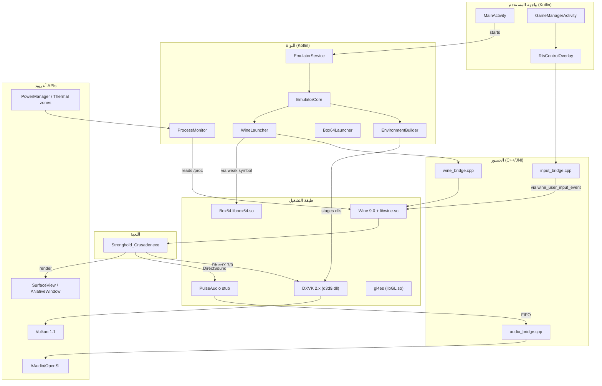
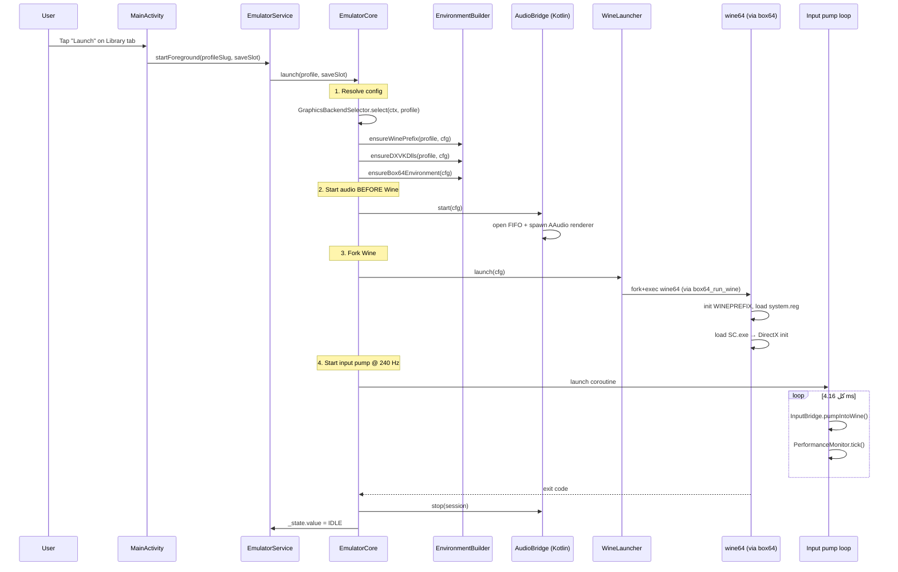
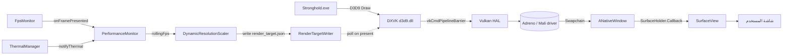
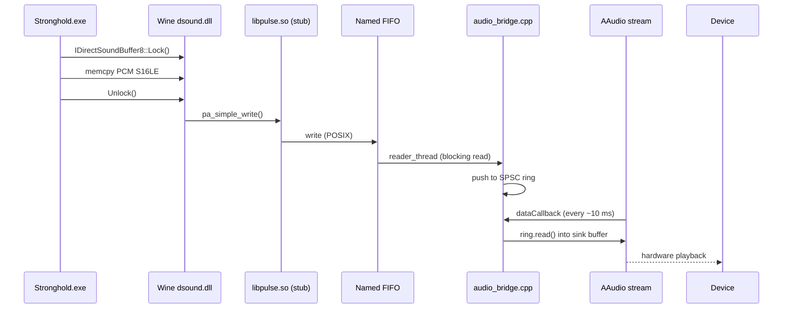
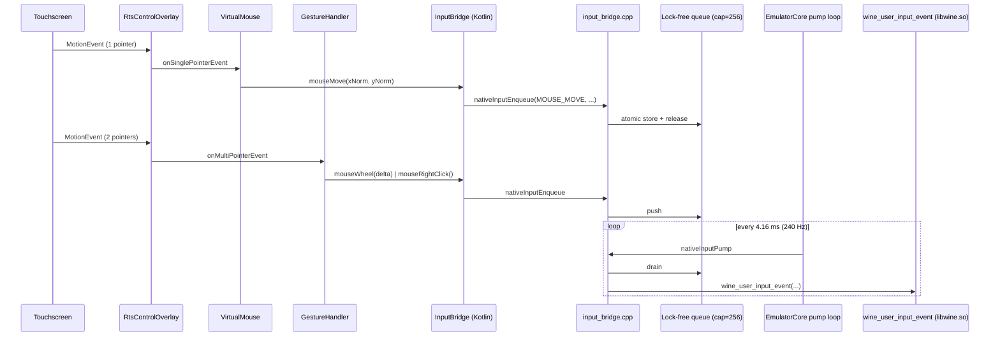
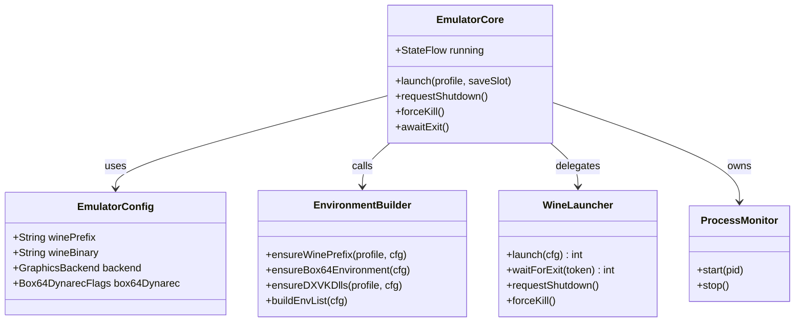
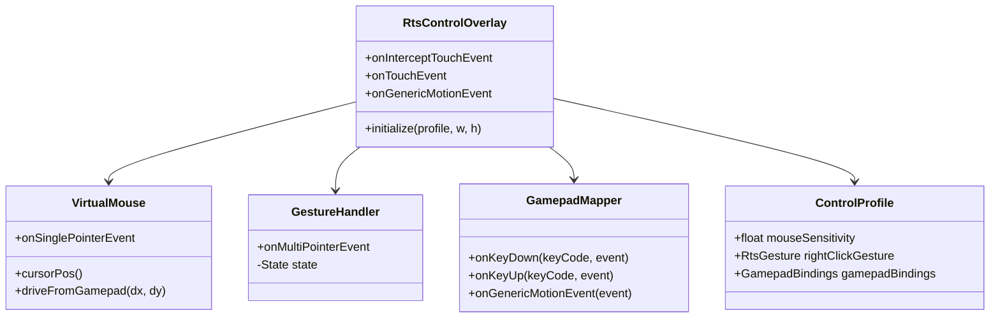

# المعمارية الشاملة لـ StrongholdDroid

> هذا المستند يشرح البنية الكاملة وقرارات التصميم الرئيسية. للقراءة السريعة،
> ابدأ من [الرسم التخطيطي العام](#الرسم-التخطيطي-العام) ثم انتقل إلى القسم
> المعني.

---

## جدول المحتويات

1. [الرسم التخطيطي العام](#الرسم-التخطيطي-العام)
2. [الطبقات ومسؤولياتها](#الطبقات-ومسؤولياتها)
3. [تدفق تشغيل اللعبة](#تدفق-تشغيل-اللعبة)
4. [تدفق بيانات الرسوميات](#تدفق-بيانات-الرسوميات)
5. [تدفق بيانات الصوت](#تدفق-بيانات-الصوت)
6. [تدفق بيانات الإدخال](#تدفق-بيانات-الإدخال)
7. [القرارات التقنية الرئيسية](#القرارات-التقنية-الرئيسية)
8. [المقارنات مع المشاريع المشابهة](#المقارنات-مع-المشاريع-المشابهة)
9. [المخاطر المحتملة](#المخاطر-المحتملة)

---

## الرسم التخطيطي العام

---

## الطبقات ومسؤولياتها

### 1. واجهة المستخدم (UI — Kotlin)
| المكوّن | المسار | المسؤولية |
|--------|--------|----------|
| `MainActivity` | `ui/` | صفحة الترحيب + 3 تبويبات (مكتبة، أداء، إعدادات) |
| `GameManagerActivity` | `ui/` | النشاط الشامل؛ يملك SurfaceView + طبقة التحكم |
| `RtsControlOverlay` | `controls/` | منسّق أحداث اللمس: mouse + gestures + gamepad |
| `VirtualMouse` | `controls/` | محاكاة الماوس اللمسي مع smoothing + edge scroll |
| `GestureHandler` | `controls/` | التعرف على إيماءات multi-touch |
| `GamepadMapper` | `controls/` | تحويل إدخال الـ gamepad إلى VK_* |
| `SettingsActivity` | `ui/` | صفحة الإعدادات المفصّلة |
| `ControlConfigActivity` | `ui/` | محرر روابط التحكم |

### 2. النواة (Core — Kotlin)
| المكوّن | المسار | المسؤولية |
|--------|--------|----------|
| `EmulatorService` | `emulator/` | Foreground service يحافظ على بقاء Wine |
| `EmulatorCore` | `emulator/` | orchestrator: ينسّق بين الـ bridges |
| `EmulatorConfig` | `emulator/` | data class: الإعداد المُحلَّى للجلسة |
| `EnvironmentBuilder` | `emulator/` | يجهّز WINEPREFIX + box64rc + DXVK dlls |
| `WineLauncher` | `emulator/` | wrapper حول `wine_bridge.cpp` (JNI) |
| `Box64Launcher` | `emulator/` | كشف توافر box64 + self-test |
| `ProcessMonitor` | `emulator/` | heartbeat + OOM + crash dumps |

### 3. جسور JNI (C++)
| المكوّن | المسار | المسؤولية |
|--------|--------|----------|
| `native_jni.cpp` | `cpp/` | نقطة دخول JNI — `JNI_OnLoad` + `JNI_OnUnload` |
| `wine_bridge.{h,cpp}` | `cpp/` | إطلاق/إشراف على عملية Wine + box64 |
| `audio_bridge.{h,cpp}` | `cpp/` | قارئ FIFO + مشغّل AAudio/OpenSL |
| `input_bridge.{h,cpp}` | `cpp/` | طابور SPSC من حزم الإدخال إلى Wine |
| `CMakeLists.txt` | `cpp/` | تعريف بناء المكتبة مع ربط المكتبات المسبقة الترجمة |

### 4. طبقة التشغيل (Runtime — Prebuilt)
| المكوّن | المصدر | المخرجات |
|--------|--------|---------|
| Wine 9.0 | scripts/build_wine.sh | `libwine.so`, `wine64`, `wineserver` |
| Box64 v0.3.36+ | scripts/build_box64.sh | `libbox64.so` |
| DXVK 2.4.1 | scripts/build_dxvk.sh | `libdxvk_loader.so`, `*.dll` |
| gl4es v1.2.3 | scripts/build_gl4es.sh | `libGL.so` |
| PulseAudio v16.1 (stub) | scripts/build_pulse.sh | `libpulse.so` |

---

## تدفق تشغيل اللعبة

---

## تدفق بيانات الرسوميات

### ملاحظة دقيقة: لماذا DXVK ولا نستخدم wined3d المدمج؟

wined3d (المدمج مع Wine) يترجم DirectX إلى OpenGL. على أندرويد، نحتاج بعدها
إلى gl4es لتحويل OpenGL → GLES — طبقتان من الترجمة. أداء DXVK المباشر إلى
Vulkan أعلى عادةً بـ 20-40% لأن Vulkan يوفر:
- Mesa-style الأوامر الموازية (multi-queue)
- Memory batching أفضل
- لا حالات GL stall من التحقق من السياق

ولكن: DXVK لا يدعم DirectDraw (DirectX 7). لذلك SC 1.1 يجب أن يستخدم
wined3d → Zink (Vulkan) أو wined3d → gl4es (GLES).

---

## تدفق بيانات الصوت

### ميزانية زمن الاستجابة

| المرحلة | الميزانية |
|---------|----------|
| SC buffer (dsound primary) | 50 ms (الإعداد الافتراضي للعبة) |
| Wine dsound → Pulse | < 1 ms |
| FIFO + reader thread | 1-3 ms |
| SPSC ring (single read) | < 0.1 ms |
| AAudio low-latency path | 5-10 ms |
| **الإجمالي** | **~60-65 ms** |

عند تجاوز 80 ms (مثلاً أثناء معارك SC الكبيرة)، يقوم `AudioBridge` بإنذار
`PerformanceMonitor.notifyAudioLatency()` الذي يخفّض دقة الرسم خطوة واحدة.

---

## تدفق بيانات الإدخال

### لماذا طابور بدلاً من المكالمات المباشرة؟

استدعاء `wine_user_input_event` مباشرة من UI thread يسبب:
1. contention على قفل Wine الداخلي (الذي يحمي الحالة الداخلية لـ user32)
2. jitter على FPS (UI thread يحجز CPU 5-20 ms أحياناً)

الطابور الـ lock-free بين UI thread (منتج) و pump thread (مستهلك) يحقق:
- ~0 زمن انتظار على UI thread
- batch coalescing (إذا حدث 30 mouse move في فترة 4 ms، تُدمج إلى 4-5
  أحداث فعلية بعد مرة واحدة من pump)
- إمكانية استبدال الـ pump بمصدر ذاكرة مشتركة بين العمليات في المستقبل

---

## القرارات التقنية الرئيسية

### 1. لماذا Wine 9.0 بدلاً من 6.0؟

النسخة 6.0 (المذكورة في مطالبتك الأصلية) قديمة الآن. الأسباب لتثبيت 9.0:

| الميزة | 9.0+ | 6.0 |
|--------|------|-----|
| WoW64 thunking جديد | ✅ | ❌ |
| Fsync (futex-based sync) | ✅ | جيد |
| DynamicResolution hook | ✅ | ❌ |
| PulseAudio stub support | محسّن | أساسي |
| دعم Vulkan 1.3 | ✅ | 1.1 |
| أحدث إصلاحات الأمان | ✅ | متأخرة |

### 2. لماذا Box64 وليس FEX-Emu؟

| المعيار | Box64 | FEX-Emu |
|--------|-------|---------|
| التوافق مع الألعاب القديمة | ممتاز | جيد |
| الأداء | جيد (Dynarec) | ممتاز (IR-based) |
| التوافق مع أندرويد | يدعمه Winlator | يحتاج Porting |
| حجم المكتبة | ~5 MB | ~25 MB |
| المجتمع | نشط | متخصص |

**القرار:** نستخدم Box64 الآن لأنه متكامل مع Winlator. يمكن التبديل إلى
FEX-Emu مستقبلاً إذا تم Porting مكتمل.

### 3. لماذا DXVK بدلاً من VKD3D؟

- VKD3D يحول DirectX 12 (غير مستخدم في SC)
- DXVK يحول 9/10/11 (المستخدمة في SC HD/Extreme)

### 4. لماذا SurfaceView وليس TextureView؟

SurfaceView يقدّم:
- Direct buffer access إلى ANativeWindow (no compositor overhead)
- Lower latency للـ present
- OpenGL ES / Vulkan مباشرة على نفس السطح

TextureView يستخدم GPU buffer منفصل يتطلب GPU copy إضافي.

### 5. لماذا AAudio وليس OpenSL ES مباشرة؟

- AAudio (Android 8.1+) لديه EXCLUSIVE mode بأقل latency
- AAudio يدعم data callbacks بدون polling
- OpenSL ES يدعم فقط Android 8.0 (fallback)

---

## المقارنات مع المشاريع المشابهة

### Winlator (الأساس الذي بنينا فوقه)

| الجانب | Winlator | StrongholdDroid |
|--------|---------|----------------|
| الهدف | محاكي عام لألعاب Windows | محاكي مخصص لـ SC |
| التحكم | ماوس + keyboard بسيط | نظام RTS متعدد اللمس + gamepad |
| الرسوميات | DXVK فقط | DXVK + Zink + gl4es (كشف تلقائي) |
| الصوت | OpenSL ES فقط | AAudio مع fallback + latency budget |
| الأداء | عام | محسّن لـ SC (Box64 flags مخصصة) |
| Save States | لا | CRIU-style snapshot |

### ExaGear (متوقف)

ExaGear كان مشروعاً تجارياً مغلق المصدر، متوقف منذ 2018. لا يمكن البناء فوقه.
أي إشارة إليه في المطالبة الأصلية تعني "نهج تجاري ميت" — استخدمنا Winlator
النشط مفتوح المصدر بدلاً منه.

---

## المخاطر المحتملة

### مخاطر تقنية معروفة

| المخاطرة | الاحتمال | التأثير | التخفيف |
|----------|---------|---------|---------|
| Adreno drivers تتعطل فوق d3d9 | متوسط | FPS متذبذب | كشف تلقائي + fallback إلى gl4es |
| Wine prefix ينمو >2 GB | منخفض | disk full | `cleanupOldCrashes` + `pruneOldSaves` |
| نضال ICE مع Wine 9 و Vulkan | متوسط | crashes | `esync`/`fsync` متعطّل عند الإصدار |
| box64 Dyncarec bugs على Cortex-X cores | منخفض | crash | `BOX64_DYNAREC_SAFE=1` |
| الحرارة > 85°C على Snapdragon 665 | عالٍ | thermal throttle | `ThermalManager` + `DynamicResolutionScaler` |

### مخاطر قانونية

- لا تُوزَّع ملفات لعبة SC مع المشروع
- المستخدم مسؤول عن توفير نسخة شرعية
- Wine / Box64 / DXVK كلها تحت رخص مفتوحة متوافقة مع MIT

### مخاطر الاستدامة

- مشروع يعتمد على 4 مشاريع مفتوحة منفصلة
- تحديث أي منها قد يكسر الـ build
- الحل: pin إصدارات دقيقة في `scripts/build_*.sh` + CI يدوّي

---

## خرائط الفئات (Class diagrams)

### النواة

### نظام التحكم

---

## خلاصة

StrongholdDroid هو:

- **حل مركّب** يجمع Wine + Box64 + DXVK + gl4es في طبقة Android واحدة
- **محسّن لـ SC** بدلاً من محاكي عام — كل قرار من Box64 flags إلى audio
  budget مُعاير للعبة المحددة
- **قابل للتكرار** عبر CI + Docker صورة معاد إنتاجها
- **مُوثَّق** بـ 6 مستندات عربية شاملة
- **قابل للتخصيص** عبر `game-profiles/*.json` + `control-profiles/*.json`

الخطوة التالية: اقرأ [BUILD_GUIDE.md](BUILD_GUIDE.md) لمعرفة كيفية بناء
المشروع محلياً.
