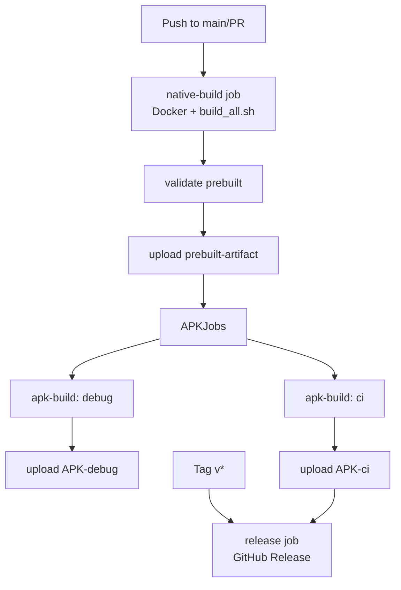

# دليل البناء الكامل لـ StrongholdDroid

> هذا الدليل يشرح بناء المشروع من المصدر — بما في ذلك جميع المكتبات
> الأصلية (Wine + Box64 + DXVK + gl4es + PulseAudio) وتجميع APK النهائي.

---

## جدول المحتويات

1. [المتطلبات](#المتطلبات)
2. [الإعداد السريع (Docker)](#الإعداد-السريع-docker)
3. [الإعداد اليدوي (Linux/macOS)](#الإعداد-اليدوي)
4. [بناء المكتبات الأصلية](#بناء-المكتبات-الأصلية)
5. [تجميع APK](#تجميع-apk)
6. [استكشاف أخطاء البناء](#استكشاف-أخطاء-البناء)
7. [CI Workflow](#ci-workflow)

---

## المتطلبات

### الأجهزة

- **CPU**: 8+ cores موصى به (16 للمثالية)
- **RAM**: 16 GB (32 GB موصى به لـ Wine build)
- **Disk**: 10 GB فضاء حر
- **OS**: Ubuntu 22.04+ / Debian 12+ / macOS 14+ (Apple Silicon)

### البرمجيات (للإعداد اليدوي)

| الأداة | الإصدار الأدنى | الغرض |
|--------|-----------------|------|
| JDK | 17 | تشغيل Gradle |
| Android SDK | 34 | SDK manager |
| Android NDK | 26.1.10909125 | cross-compilation |
| CMake | 3.25+ | بناء DXVK + gl4es |
| Meson + Ninja | 1.4 / 1.12 | بناء Wine + PulseAudio |
| Mingw-w64 | 11.0+ | بناء DXVK DLLs |
| Python | 3.9+ | Meson + setuptools |
| Bash + coreutils | — | سكربتات البناء |

---

## الإعداد السريع (Docker)

إذا كان لديك Docker مثبتاً (الطريقة الموصى بها)، فالبناء كامل يأمر واحد:

```bash
# استنساخ المستودع
git clone https://github.com/your-org/StrongholdDroid.git
cd StrongholdDroid

# بناء الصورة (مرة واحدة، ~10 دقائق)
docker build -t strongholddroid-builder scripts/docker/

# بناء كل شيء + APK
scripts/docker/build.sh debug
```

الصورة قائمة على Ubuntu 22.04 وتثبّت:
- NDK 26.1.10909125
- Mingw-w64
- Meson + Ninja + CMake
- كل اعتمادات Wine (libfreetype, X11, GStreamer...)

بعد اكتمال البناء، ستجد APK في:

```
app/build/outputs/apk/debug/app-debug.apk
```

---

## الإعداد اليدوي

للمطوّرين الذين يفضّلون عدم استخدام Docker:

### 1. تثبيت JDK 17 + Android SDK

```bash
# Ubuntu/Debian
sudo apt install openjdk-17-jdk-headless unzip wget

# macOS
brew install openjdk@17

# Android SDK + cmdline-tools
mkdir -p ~/Android/Sdk/cmdline-tools
cd ~/Android/Sdk/cmdline-tools
wget https://dl.google.com/android/repository/commandlinetools-linux-11076708_latest.zip
unzip commandlinetools-linux-11076708_latest.zip
mv cmdline-tools latest
echo 'export PATH=$PATH:$HOME/Android/Sdk/cmdline-tools/latest/bin' >> ~/.bashrc
source ~/.bashrc
yes | sdkmanager --licenses
yes | sdkmanager "platform-tools" "platforms;android-34"
```

### 2. تشغيل setup_toolchain.sh

```bash
cd StrongholdDroid
./scripts/setup_toolchain.sh
```

هذا السكربت يثبّت تلقائياً:

| المكون | المصدر |
|--------|---------|
| Android NDK 26.1 | sdkmanager |
| Meson 1.4 | pip3 |
| Ninja 1.12 | pip3 |
| Mingw-w64 | apt / brew |
| CMake 3.30 | pip3 |
| patchelf | apt / brew |
| اعتماديات Wine (libfreetype, X11, etc.) | apt |

التحقق:

```bash
which meson ninja x86_64-w64-mingw32-gcc
# يجب أن تطبع المسارات
```

### 3. تعيين متغيرات البيئة

أنشئ `local.properties` في جذر المشروع:

```properties
sdk.dir=/home/user/Android/Sdk
native.prebuilt.dir=/home/user/strongholddroid-prebuilt
dxvk.dll.dir=/home/user/strongholddroid-prebuilt/dxvk-wine-dlls
```

`native.prebuilt.dir` يجب أن يشير إلى مجلد ستقوم سكربتات البناء بإنشائه
تحت `app/src/main/cpp/prebuilt/`.

---

## بناء المكتبات الأصلية

الطريقة الموصى بها: استخدم `build_all.sh` الذي ينسّق كل المكوّنات بالترتيب
الصحيح:

```bash
./scripts/build_all.sh
```

### ترتيب البناء والمدة التقريبية

| الخطوة | المكون | المدة (~16-core) |
|--------|--------|------------------|
| 1 | setup_toolchain.sh | 5 min (one-time) |
| 2 | PulseAudio | 8 min |
| 3 | Wine 9.0 | 25 min |
| 4 | Box64 | 5 min |
| 5 | gl4es | 4 min |
| 6 | DXVK + Vulkan loader | 25 min |
| **الإجمالي** | | **~70 min** |

### البناء المنفصل لكل مكوّن

لتصحيح الأخطاء أو البناء المتزايد:

```bash
# بناء Wine فقط
./scripts/build_wine.sh

# بناء Box64 فقط
./scripts/build_box64.sh

# بناء DXVK فقط (يحتاج Wine headers من الخطوة السابقة)
./scripts/build_dxvk.sh

# بناء gl4es (مستقل)
./scripts/build_gl4es.sh
```

### المخرجات النهائية

بعد `build_all.sh`، يجب أن تجد تحت `app/src/main/cpp/prebuilt/arm64-v8a/`:

```
libwine.so
libwine.so.1
libbox64.so
libpulse.so.0
libpulse-simple.so.0
libpulsecommon.so
libGL.so
libGL.so.1
libdxvk_loader.so
libwine/wine64
libwine/wineserver
wine_dlls/*.dll          (Wine builtin: d3d9, ddraw, dsound, dinput8, ...)
dxvk-wine-dlls/*.dll     (DXVK native: d3d9, d3d11, dxgi, d3dcompiler_47)
```

التحقق:

```bash
./scripts/build_all.sh  # تطبع التحقق في النهاية
# أو يدوياً:
ls -lh app/src/main/cpp/prebuilt/arm64-v8a/
```

---

## تجميع APK

بعد اكتمال البناء الأصلي:

```bash
# إصدار Debug (لاكتشاف الأخطاء)
./scripts/build_apk.sh debug

# إصدار CI (بدون LTO، أسرع للـ CI)
./scripts/build_apk.sh ci

# إصدار Release (يحتاج keystore)
export STRONGHOLDDROID_KEYSTORE=/path/to/keystore.jks
export STRONGHOLDDROID_STORE_PASSWORD=...
export STRONGHOLDDROID_KEY_ALIAS=...
export STRONGHOLDDROID_KEY_PASSWORD=...
./scripts/build_apk.sh release
```

### APK Splitting

تم تكوين `app/build.gradle.kts` لإنتاج ABI-specific APKs بشكل افتراضي:

- `app-arm64-v8a-release.apk` — أصغر (~30 MB أصغر من universal)
- `app-universal-release.apk` — يحتوي على arm64-v8a فقط (x86_64 مستثنى من release)

### التثبيت على الجهاز

```bash
# عبر USB
adb install -r app/build/outputs/apk/debug/app-debug.apk

# بدء التطبيق
adb shell am start -n com.strongholddroid.emulator.debug/com.strongholddroid.emulator.ui.MainActivity

# متابعة logcat
adb logcat -s strongholddroid-jni:V strongholddroid-wine:V wine-stdout:V
```

---

## استكشاف أخطاء البناء

### "CMake: prebuilt libs not found"

```
!!!!!!!!!!!!!!!!!!!!!!!!!!!!!!!!!!!!!!!!!!!!!!!!!!!!!!!!!!!!!!!!
! Prebuilt native libraries not found in:
!   /path/to/app/src/main/cpp/prebuilt/arm64-v8a
! ...
!!!!!!!!!!!!!!!!!!!!!!!!!!!!!!!!!!!!!!!!!!!!!!!!!!!!!!!!!!!!!!!!
```

**السبب**: لم تشغّل `build_all.sh` بعد، أو فشل بشكل صامت.

**الحل**: تحقق من وجود الملفات:

```bash
ls app/src/main/cpp/prebuilt/arm64-v8a/
# يجب أن تجد libwine.so, libbox64.so, libpulse.so, libGL.so, libdxvk_loader.so
```

### "Wine configure: unknown option --with-android"

**السبب**: إصدار Wine قديم أو لم تُطبّق الـ patches.

**الحل**: تحقق من `scripts/patches/wine/` — يجب أن يحتوي على ملف `.patch`
يضيف دعم `--with-android` إلى `configure`. أعد استنساخ Wine وأعد تشغيل
`build_wine.sh`.

### "box64 build: ARM_DYNAREC=ON but no __ARM_NEON"

**السبب**: NDK الحالي لا يفعّل NEON افتراضياً على arm64-v8a.

**الحل**: تأكد من `-DCMAKE_C_FLAGS="-mfpu=neon"` أو أضف إلى CMake.

### "Gradle: build was configured to prefer settings repositories"

**السبب**: تحذير غير قاتل من Android Gradle Plugin 8+.

**الحل**: تجاهله — البناء ينجح رغم ذلك.

### "APK build: OutOfMemoryError in daemon"

**السبب**: JVM heap أقل من 4 GB.

**الحل**: تأكد من `gradle.properties`:

```properties
org.gradle.jvmargs=-Xmx4096m -XX:MaxMetaspaceSize=1024m
```

### "Docker build: command 'docker' not found"

**الحل**: ثبّت Docker Desktop / Docker Engine.

---

## CI Workflow

يعمل `.github/workflows/build.yml` كالتالي:



### المتغيرات السرية المطلوبة للـ release

في GitHub Settings → Secrets:

- `KEYSTORE_BASE64` — ملف keystore بصيغة base64
- `STORE_PASSWORD`
- `KEY_ALIAS`
- `KEY_PASSWORD`

لإنشاء keystore:

```bash
keytool -genkeypair -v \
  -keystore strongholddroid.jks \
  -keyalg RSA -keysize 4096 \
  -validity 10000 \
  -alias strongholddroid
base64 strongholddroid.jks > keystore.b64
# انسخ محتوى keystore.b64 إلى KEYSTORE_BASE64 secret
```

---

## تحديث الإصدارات

لتحديث أي مكتبة:

1. عدّل `scripts/build_<lib>.sh` وتغيّر `*_VERSION`
2. احذف `build/<lib>-<old>` لتنزيل النسخة الجديدة
3. أعد تشغيل `build_all.sh`

مثال لتحديث Box64 من v0.3.36 إلى v0.3.40:

```bash
sed -i 's/BOX64_VERSION="v0.3.36"/BOX64_VERSION="v0.3.40"/' scripts/build_box64.sh
rm -rf build/box64-v0.3.36
./scripts/build_box64.sh
```

---

## خلاصة

| الخطوة | الأمر | المدة |
|--------|-------|------|
| استنساخ | `git clone ...` | < 1 min |
| Docker setup | `docker build -t strongholddroid-builder scripts/docker/` | ~10 min |
| بناء الأصلي | `scripts/docker/build.sh debug` | ~70 min |
| النتيجة | `app/build/outputs/apk/debug/app-debug.apk` | — |

الخطوة التالية: اقرأ [USER_MANUAL.md](USER_MANUAL.md) لتعلّم كيفية استخدام
التطبيق.
